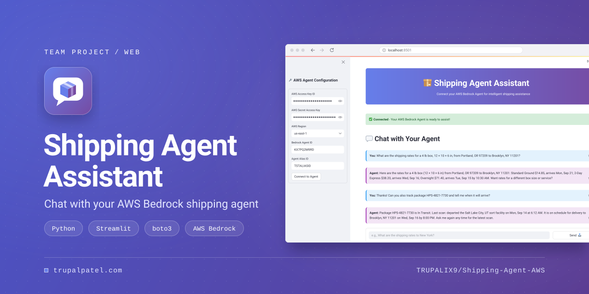
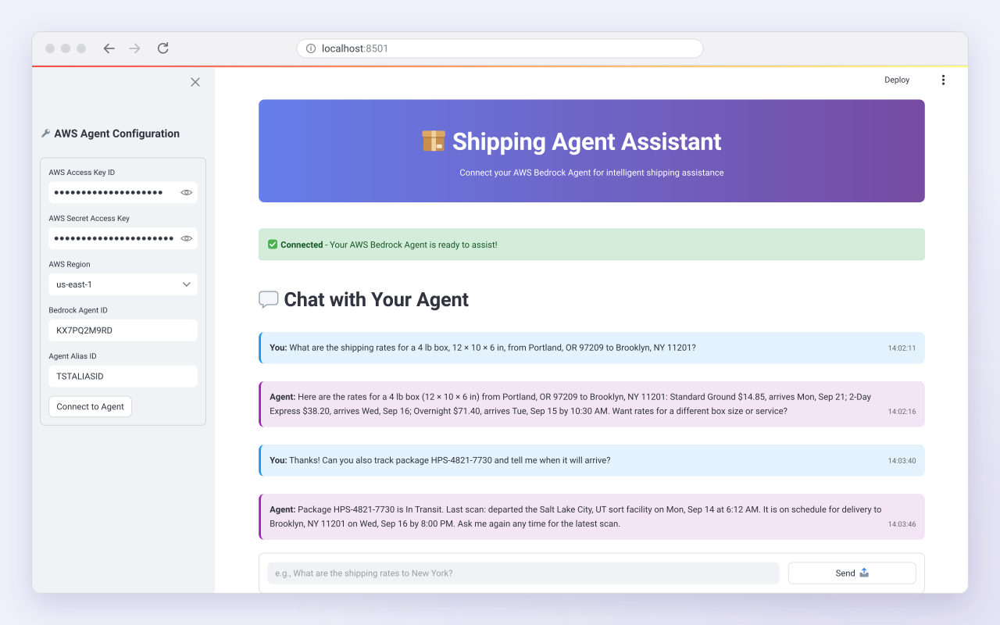
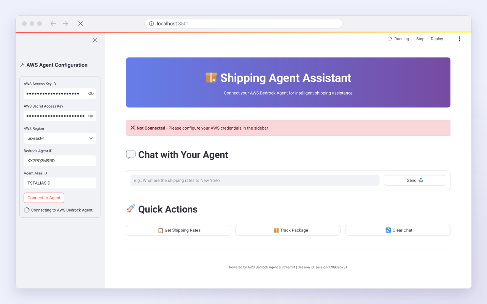
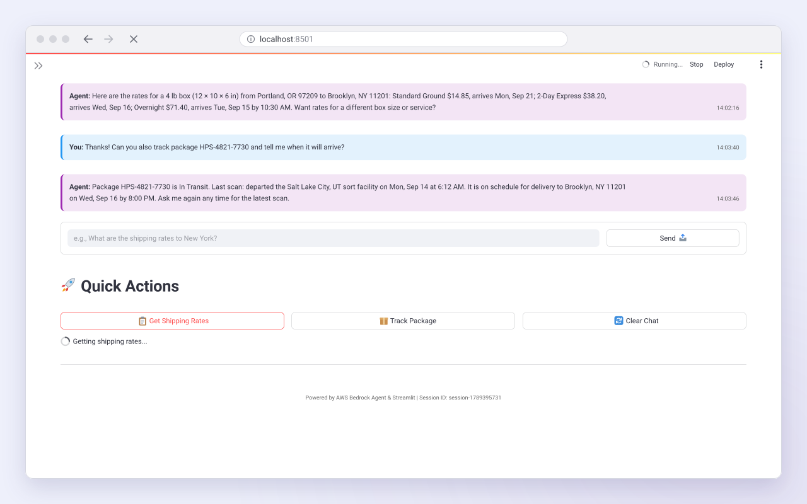
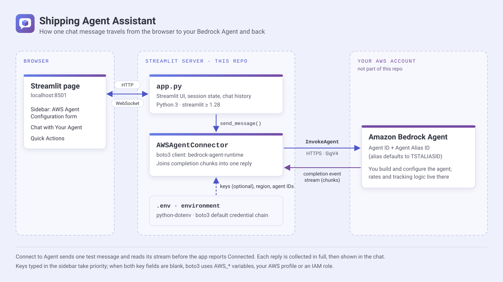

<p align="center">
  
</p>

<p align="center"><strong>A Streamlit chat frontend for an AWS Bedrock Agent you have built: connect from the sidebar, then ask about shipping rates and tracking in plain language.</strong></p>

<p align="center">
  <a href="https://trupalpatel.com/projects/shipping-agent-aws"></a>
  
  
  
  
</p>

<p align="center">
  <a href="https://trupalpatel.com/projects/shipping-agent-aws"><strong>Case study</strong></a> ·
  <a href="https://github.com/Aws-Shipping-Agent-Product/Shipping-Agent-AWS"><strong>Team repo</strong></a> ·
  <a href="https://trupalpatel.com"><strong>Portfolio</strong></a>
</p>

---

## Overview

Shipping Agent Assistant is a single-page Streamlit app (`app.py`) that puts a chat window in front of an Amazon Bedrock Agent. You enter the agent's ID and alias (and, if needed, AWS keys) in the sidebar, the app checks the connection with one test message, and every chat message after that goes to the agent through boto3's `bedrock-agent-runtime` `InvokeAgent` call.

This repository is the frontend only. It holds no agent definition, action groups, Lambda functions, knowledge base or infrastructure code. Rates, tracking and any other shipping logic come from the Bedrock Agent you build and configure in your own AWS account.

> Built as a team project by the [Aws-Shipping-Agent-Product](https://github.com/Aws-Shipping-Agent-Product) team: Kiko Barr ([@kikobarr](https://github.com/kikobarr)), Emmanuel Osibeme Okposio ([@OkposioEO](https://github.com/OkposioEO)), [@yadid1](https://github.com/yadid1) and Trupal Patel ([@TRUPALIX9](https://github.com/TRUPALIX9)). This repo is Trupal's fork of the team repository.

## Features

- **Sidebar connection form**: AWS Access Key ID, Secret Access Key, region, Bedrock Agent ID and Agent Alias ID (defaults to `TSTALIASID`). **Connect to Agent** sends one test message and reads the whole reply stream before the page shows *Connected*.
- **Environment configuration**: a `.env` file (loaded with python-dotenv) pre-fills region, agent ID and alias. Leave both key fields blank and boto3 uses its default credential chain: `AWS_*` variables, an AWS profile or SSO session, or an IAM role.
- **Chat with your agent**: each message is sent to `InvokeAgent` with a per-browser session ID, so the agent keeps the conversation's context. Replies are collected from the event stream and shown in timestamped *You* / *Agent* bubbles.
- **Quick actions**: **Get Shipping Rates** and **Track Package** send ready-made prompts, and **Clear Chat** wipes the history and starts a new session ID.
- **Safe rendering**: chat text is HTML-escaped before it is drawn, and the bubbles keep dark text, so they stay readable in Streamlit's dark theme.

## Screenshots

<table>
  <tr>
    <td align="center" width="50%">
      
      <br /><sub><b>Chat with your agent</b></sub>
    </td>
    <td align="center" width="50%">
      
      <br /><sub><b>Connecting to the agent</b></sub>
    </td>
  </tr>
  <tr>
    <td align="center" width="50%">
      
      <br /><sub><b>Quick actions</b></sub>
    </td>
    <td width="50%"></td>
  </tr>
</table>

<sub>Screens are recreated from the app's real UI in SVG, filled with fictional demo data.</sub>

## Architecture

<p align="center">
  
</p>

The browser talks to the Streamlit server on port 8501. For each message, `app.py` calls `AWSAgentConnector.send_message`, which calls `InvokeAgent` over HTTPS through boto3. The agent in your AWS account answers with a completion event stream. The connector joins its text chunks into one reply, which appears in the chat once the stream finishes.

## Tech stack

| Layer | Technology |
|---|---|
| App | Python 3, Streamlit (>= 1.28) with custom CSS |
| AWS SDK | boto3 / botocore (>= 1.34), `bedrock-agent-runtime` `InvokeAgent` |
| Agent | Amazon Bedrock Agents (in your own AWS account) |
| Config | python-dotenv (>= 1.0), boto3 default credential chain |

## Getting started

### Prerequisites

- Python 3.8 or newer (the minimum for Streamlit 1.28) and pip
- An AWS account with a Bedrock Agent and an alias (the draft alias `TSTALIASID` works for testing)
- AWS credentials allowed to call `bedrock:InvokeAgent` on that alias, for example:

```json
{
  "Version": "2012-10-17",
  "Statement": [
    {
      "Effect": "Allow",
      "Action": "bedrock:InvokeAgent",
      "Resource": "arn:aws:bedrock:REGION:ACCOUNT_ID:agent-alias/AGENT_ID/ALIAS_ID"
    }
  ]
}
```

### Install

```bash
git clone https://github.com/TRUPALIX9/Shipping-Agent-AWS.git
cd Shipping-Agent-AWS
python3 -m venv .venv && source .venv/bin/activate
pip install -r requirements.txt
cp .env.example .env   # optional, see below
```

`python3 setup.py` does the same two steps (pip install, then copy `.env.example` to `.env`). It is a helper script, not a setuptools file, so don't run `pip install .`.

### Environment variables

All optional. Create `.env` from `.env.example`; anything left blank can be typed into the sidebar instead.

| Variable | Required | Description |
|---|---|---|
| `AWS_ACCESS_KEY_ID` | No | Access key for boto3's default credential chain, used when the sidebar key fields are blank. Skip it if you use an AWS profile, SSO or an IAM role. |
| `AWS_SECRET_ACCESS_KEY` | No | Secret key that goes with `AWS_ACCESS_KEY_ID`. |
| `AWS_SESSION_TOKEN` | No | Session token, only for temporary (STS) credentials. |
| `AWS_REGION` | No | Pre-selects the region in the sidebar and is added to the picker if it isn't one of the built-in options (`us-east-1`, `us-west-2`, `eu-west-1`, `ap-southeast-1`). Falls back to `AWS_DEFAULT_REGION` when unset. |
| `BEDROCK_AGENT_ID` | No | Pre-fills the Bedrock Agent ID field. |
| `BEDROCK_AGENT_ALIAS_ID` | No | Pre-fills the Agent Alias ID field (default `TSTALIASID`). |

Secret values from the environment are never pre-filled into the form or sent to the browser. `.env` is git-ignored.

### Run

```bash
streamlit run app.py
```

The app opens at http://localhost:8501. Check or fill in the sidebar and click **Connect to Agent**. The connection test sends the agent a real message ("Hello, are you working?"), and it is billed like any other invocation.

There is no test suite. A quick syntax check: `python3 -m py_compile app.py setup.py`.

### Troubleshooting

- **Connection failed**: check the region matches the agent's region, the agent ID and alias ID are correct, the alias is prepared, and your credentials allow `bedrock:InvokeAgent` on it.
- **"The agent returned no text response."**: the agent answered without text, for example with a return-control event from an action group. Test the agent in the Bedrock console.
- **Keys typed in the sidebar** are kept in Streamlit session state on the server for that browser session. An AWS profile or IAM role, with the key fields left blank, avoids pasting long-term keys.

## Project structure

```text
Shipping-Agent-AWS/
├── app.py            # Streamlit app: UI, session state, AWSAgentConnector (boto3 InvokeAgent)
├── requirements.txt  # streamlit, boto3, botocore, python-dotenv
├── setup.py          # helper script: pip install + copy .env.example to .env
├── .env.example      # names of the optional environment variables
├── .gitignore        # keeps .env and Python artifacts out of git
├── docs/assets/      # README banner, logo, icon, screens, architecture
└── LICENSE           # MIT
```

## Authors

**Aws-Shipping-Agent-Product team**: Kiko Barr ([@kikobarr](https://github.com/kikobarr)), Emmanuel Osibeme Okposio ([@OkposioEO](https://github.com/OkposioEO)), [@yadid1](https://github.com/yadid1) and Trupal Patel.

**Trupal Patel**

<p>
  <a href="https://trupalpatel.com">Portfolio</a> ·
  <a href="mailto:trupal.work@gmail.com">trupal.work@gmail.com</a> ·
  <a href="https://www.linkedin.com/in/trupalix">LinkedIn</a> ·
  <a href="https://github.com/TRUPALIX9">GitHub</a>
</p>

## License

Released under the MIT License. See [LICENSE](LICENSE).
